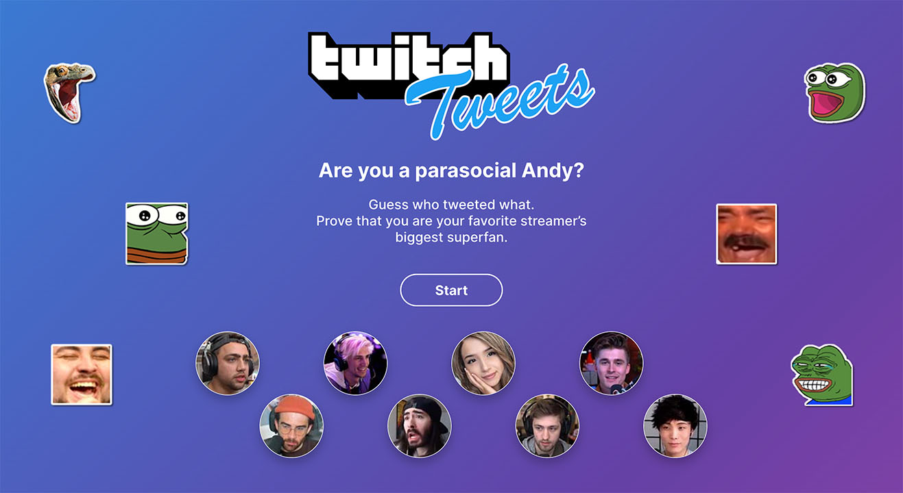
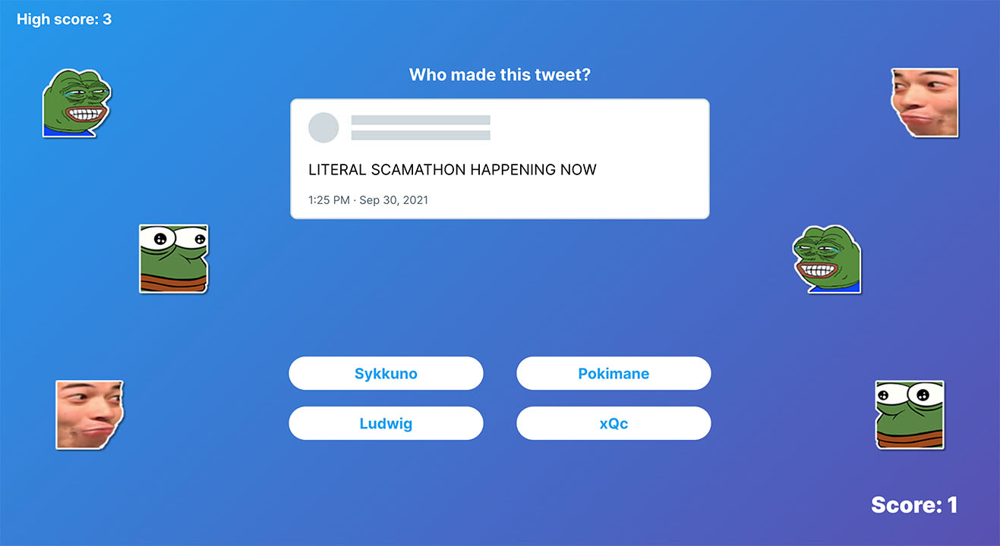

<!-- LOGO -->

    
 

<!-- HEADER -->
# Twitch Tweets (production branch)

Hello! Welcome to the Production repo for [https://twitchtweets.com/](http://twitchtweets.com/)

For the Development repo, visit [https://github.com/brandonhudavid/twitch-tweets](https://github.com/brandonhudavid/twitch-tweets)

<!-- ABOUT -->
## What is Twitch Tweets?

Twitch Tweets is a simple game that undeniably proves how well you know your live streamers. Get a random Tweet, and guess who made the tweet from 4 of your favorite streamers. Keep guessing until you take the L.

  
  

There are 8 streamers featured:
* Mizkif
* xQc
* Pokimane
* Ludwig
* HasanAbi
* MoistCr1TiKaL
* Sodapoppin
* Sykkuno

And there are 5 hand-picked tweets from each streamer, so 40 tweets in total. 

### Built With

* [React.js](https://reactjs.org/)
  * [react-reveal](https://www.react-reveal.com/)
  * [react-twitter-embed](https://www.npmjs.com/package/react-twitter-embed)
* [Lodash](https://lodash.com/)

<!-- ROADMAP -->
## Roadmap

If public reception of this game is good, I'll consider expanding the game to other live streaming subcommunities. The following is a list of streaming circles I'd like to highlight and expand this game to:

- OfflineTV
- OTK
- HololiveEN
- VShojo

<!-- CONTRIBUTING -->
## Contributing

Thanks for your interest in contributing! At the moment, I have not set up a streamlined way for others to contribute. However, I think it would be cool to clean up the code so that others could expand the game to different streaming circles via a simple Pull Request (or even a Google Form for the less tech savvy).

If you're interested in contributing, let's keep in touch! Feel free to contact me on Twitter: [@bdiddydavid](https://twitter.com/bdiddydavid)

<!-- CONTACT -->
## Contact

Twitter: [@bdiddydavid](https://twitter.com/bdiddydavid)

<!-- ACKNOWLEDGMENTS -->
## Acknowledgments

* [The Higher Lower Game](http://www.higherlowergame.com/) - a huge inspiration for the design of this game
* [English Sandwich's food quiz](https://englishsandwich.github.io/) - for showing how simple games can still be captivating
* All streamers - for providing us with free content every day
* Friends who helped with user testing - thanks for helping me polish the game before v1.0.0 release
